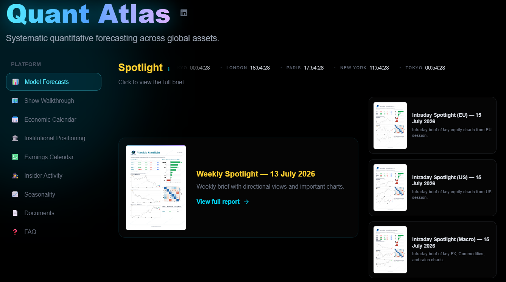
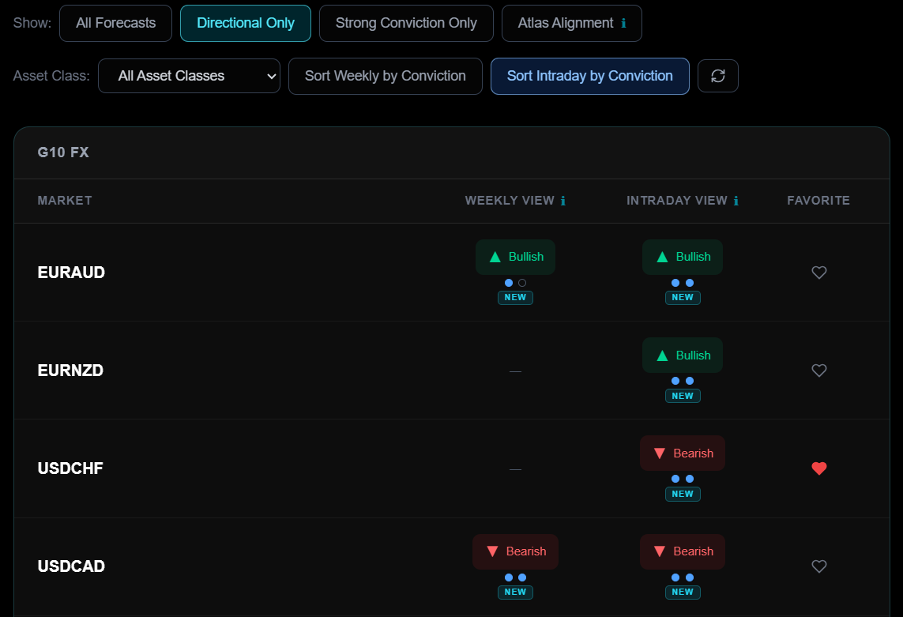

# Sofien Kaabar, CFA

## Quant Atlas

Quant Atlas is a quantitative forecasting platform focused on systematic models, data-driven insights, and high-quality charting across financial markets.

  

---

## 📚 Books

### [Book Title Placeholder]

A concise description of the book goes here. Focus on what it delivers and who it’s for.

  

---

## 📄 Research Papers

- Paper Title 1 — Short description
- Paper Title 2 — Short description
- Paper Title 3 — Short description
- Paper Title 4 — Short description
- Paper Title 5 — Short description

---

## 🌐 Links

- Website: https://www.quant-atlas.com  
- Contact: contact@quant-atlas.com  
