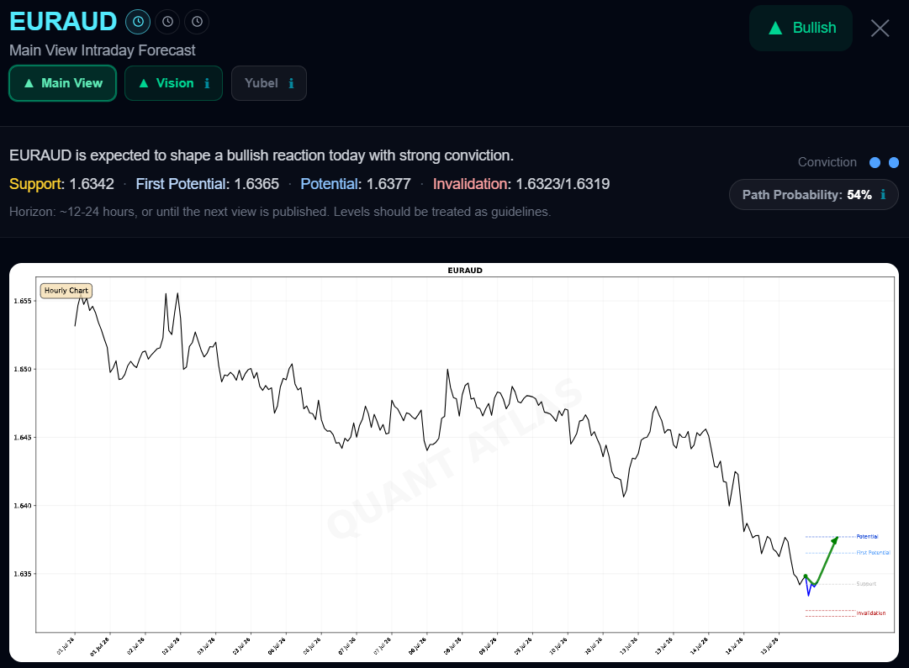

# Sofien Kaabar, CFA

## **[Quant Atlas](https://www.quant-atlas.com)** Institutional-Grade Market Forecasting Platform

Quant Atlas is a: 

1) quantitative market forecasting platform,  
2) alternative alpha capture dataset provider, 
3) view provider for brokers and trading platforms.  

Focused on a combination of quantitative, technical, and sentiment analyses, Quant Atlas delivers a second opinion for market professionals.  

**Free trials** are available.

  
  
  

---

## 📚 Books

### **[Mastering Financial Markets with Python: New Horizons in Technical Analysis](https://amzn.to/4qClaDF)**

An evidence-based objective approach for Technical Analysis using Python. A must have for any scientific-background traders interested in Technical Analysis.

  

---

## 📄 Research Papers

Kaabar (2026). Sequential Pattern Averaging Regressor: A Lookup-Based Method for Structural Price Prediction. 
Kaabar (2026). Extrema Precision 2.0: A Framework for Evaluating Reversal Signal Localization. 
Kaabar (2026). A Comparative Analysis of Linear Regression and DLinear for Time Series Forecasting. 
Kaabar (2026). Eliminating Subjectivity in Moving Average Crossovers via Symmetric Weighted Filters. 
Kaabar (2026). Standard RSI vs. Bollinger-Filtered RSI: A Comparative Market Timing Analysis. 
Kaabar (2025). Magic Numbers or Market Noise? Deconstructing the TD Setup in Time Series Predictions. 
Kaabar (2025). Quantifying Market Timing Accuracy with the Extrema Precision Index (EPI). 
Kaabar (2025). Quantifying Exhaustion: A Regime-Dependent Analysis of TD Sequential and RSI Filters. 
Kaabar (2025). Phase-Preserving Denoising in Financial Time Series: Singular Spectrum Analysis and Linear Moving Averages.

---

## 🌐 Links

- Website: https://www.quant-atlas.com  
- Contact: contact@quant-atlas.com  
